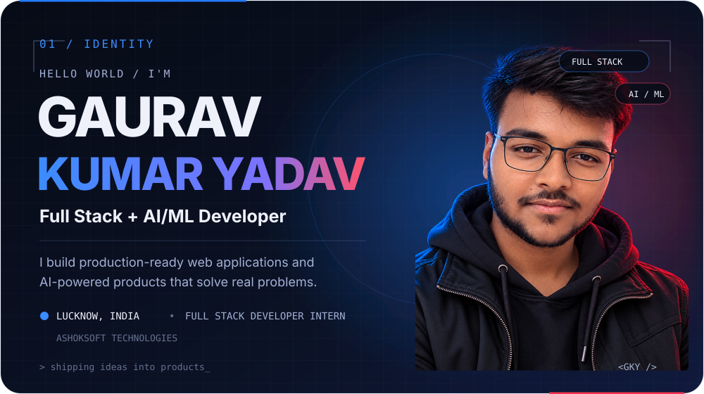
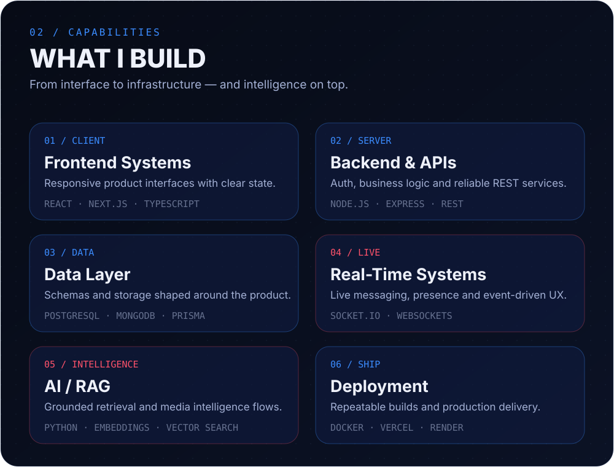
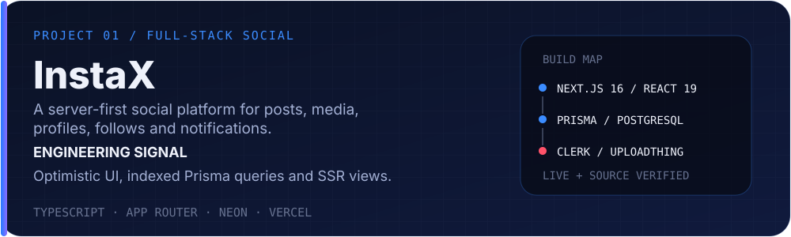
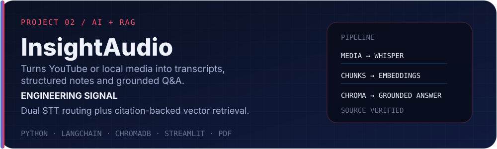
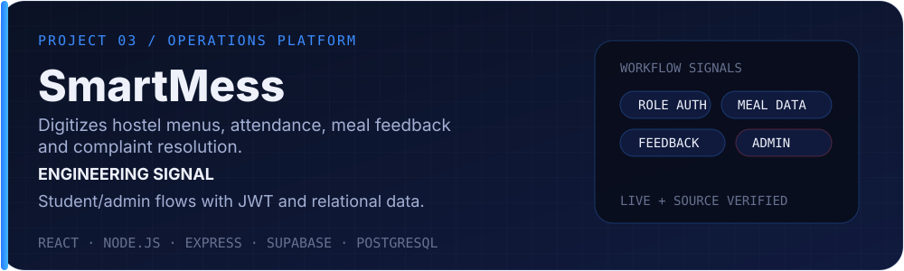
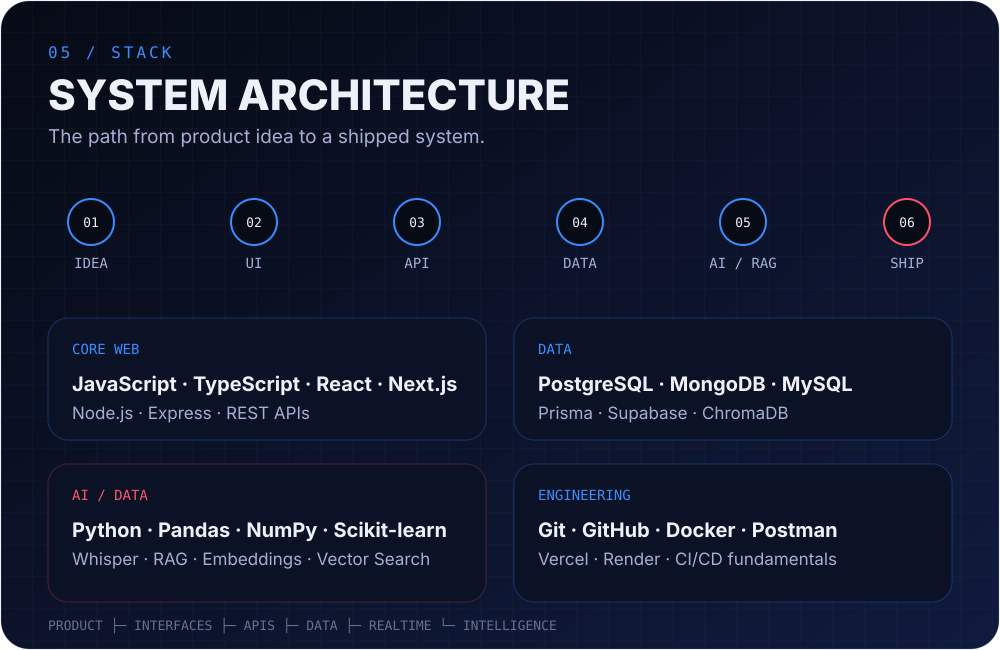
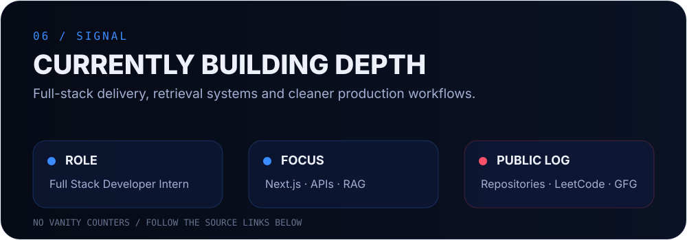
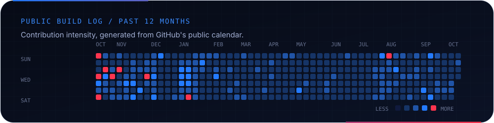
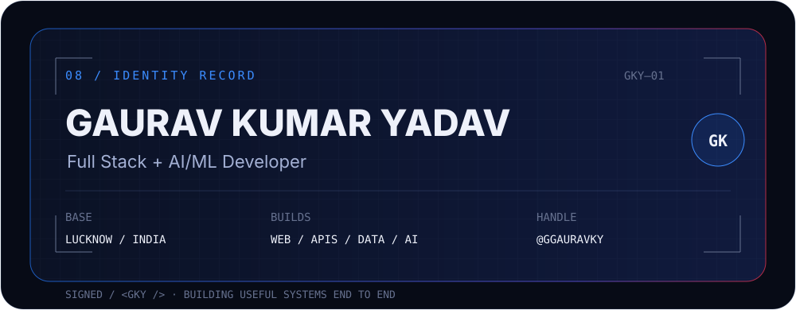
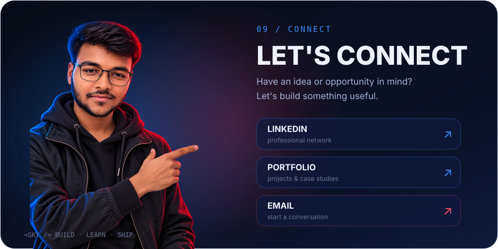

  

  <a href="https://ggauravky.vercel.app/"><strong>Portfolio ↗</strong></a>
  &nbsp;&nbsp;·&nbsp;&nbsp;
  <a href="https://www.linkedin.com/in/gauravky/"><strong>LinkedIn ↗</strong></a>
  &nbsp;&nbsp;·&nbsp;&nbsp;
  <a href="mailto:kumar.gaurav.yadav2007@gmail.com"><strong>Email ↗</strong></a>
  &nbsp;&nbsp;·&nbsp;&nbsp;
  <a href="https://github.com/ggauravky"><strong>GitHub ↗</strong></a>

  I build production-ready web applications and AI-powered products — from interfaces and APIs to data, real-time systems and RAG.

 

## What I build

 

## Selected work

Products chosen for engineering depth, technical range and recruiter value.

**InstaX** — Server-first social product with posts, media, profiles, follows and notifications. 
[Live app ↗](https://instax-g.vercel.app/) · [Source code ↗](https://github.com/ggauravky/InstaX)

 

**InsightAudio** — Media ingestion, bilingual speech-to-text, structured meeting intelligence and citation-backed RAG. 
[Source code ↗](https://github.com/ggauravky/InsightAudio)

 

**SmartMess** — Role-based hostel dining operations for menus, attendance, ratings and complaints. 
[Live app ↗](https://smartmesslms.vercel.app/) · [Source code ↗](https://github.com/ggauravky/SmartMess)

 

**TrueCert** — Certificate issuance and public verification with signatures, QR codes, PDFs and scan analytics. 
[Source code ↗](https://github.com/ggauravky/TrueCert)

 

## Journey

 

## Stack

 

## Current signal

 

## GitHub momentum

  <code>07 / ACTIVITY</code> 
  Consistency behind the projects.

<!-- streak:start -->

  

<!-- streak:end -->

<code>@ggauravky · ACTIVITY / CONSISTENCY / OPEN SOURCE</code>

  <a href="https://github.com/ggauravky?tab=repositories">Repositories ↗</a>
  &nbsp;&nbsp;·&nbsp;&nbsp;
  <a href="https://leetcode.com/u/gauravky/">LeetCode ↗</a>
  &nbsp;&nbsp;·&nbsp;&nbsp;
  <a href="https://www.geeksforgeeks.org/profile/gauravky">GeeksforGeeks ↗</a>

 

## Developer ID

 

  <a href="https://www.linkedin.com/in/gauravky/"><strong>LinkedIn ↗</strong></a>
  &nbsp;&nbsp;·&nbsp;&nbsp;
  <a href="https://ggauravky.vercel.app/"><strong>Portfolio ↗</strong></a>
  &nbsp;&nbsp;·&nbsp;&nbsp;
  <a href="mailto:kumar.gaurav.yadav2007@gmail.com"><strong>Email ↗</strong></a>

  <code>&lt;GKY /&gt;</code>&nbsp;&nbsp; BUILD · LEARN · SHIP

